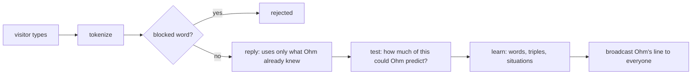

# ohm-api
The backend of **Ohm, the internet's robot pet**: one pixel robot shared by everyone online.
Visitors charge it, play with it, reboot it, and teach it to talk.

- Live API: `https://ohm-api.t4magoro.workers.dev` (`/state`, `/vitals`, `/ws`)
- Live site: `https://t4magoro.github.io/ohm/` (frontend repo: `t4magoro/ohm`)

## Stack

| Part | Tech |
|---|---|
| Server | TypeScript Cloudflare Worker + one Durable Object `Ohm` (SQLite, WebSocket hibernation, alarms) |
| Pet math | C++ compiled to WebAssembly (`cpp/pet.cpp`, no heap, fixed static buffer) |
| Word lists | `tools/build_wordlists.py` → `wordlists/` (FrequencyWords top 30k id + en, LDNOOBW blocklist + `block-id.txt`) |
| Tests | Vitest against real SQLite (`node:sqlite`) and the real `pet.wasm`; native C++ asserts with sanitizers |

## Running it

Everything runs in Docker. You don't need Node on the host.

| Task | Command |
|---|---|
| Start the API | `docker compose up -d`, then open http://localhost:8787/state |
| C++ test | `docker compose exec api npm run test:cpp` |
| Unit tests | `docker compose exec api npm test` |
| Typecheck | `docker compose exec api npm run typecheck` |
| Rebuild word lists | `docker run --rm -v "${PWD}:/app" -w /app python:3.13-alpine python tools/build_wordlists.py` |

For local secrets, copy them into `.dev.vars` (gitignored): `ADMIN_TOKEN`, `IP_SALT`, `FAKE_WEATHER`.

---

## How Ohm learns to talk

Ohm has no AI model. It **counts which word follows which** in what visitors type, and **which words people
use in which situation** (rain, night, charging…). To talk, it repeatedly picks a likely next word. It can only
say words it has learned. There are **no levels**: Ohm babbles where it has no evidence and speaks in sentences
where it has, from the very first message. Every rule below was tested before it was built, in a simulation with
real Bandung weather: `ohm-app/research/brain_sim.ipynb`.

The code: `src/brain.ts` (learning and talking), `src/grounding.ts` (word + situation links), `src/mind.ts`
(skills and counters), `src/situation.ts` (what's happening now), `cpp/pet.cpp` (the weighted random pick).

### 1. From message to words

`tokenize` (`src/words.ts`) lowercases the text and keeps only letters, plus `'` and `-` inside a word.
It reads at most 20 words:

```
"Aku  SUKA kopi!!"  →  ["aku", "suka", "kopi"]
```

If **any** word is on a blocklist (the built-in one or the admin's), the whole message is rejected.
Ohm doesn't reply, and it learns nothing.

### 2. Answer first, then test, then learn



Ohm replies **before** it learns from the message. Done the other way round, a sentence full of brand-new
words would be the only path the chain knows, and it would come straight back out to everyone online.
Visitors' messages are never stored as sentences or shown to others: only single words and counts are kept,
and only Ohm's replies are broadcast.

### 3. Learning: words, triples and the visitor rule

`hear()` looks at each word:

| The word is… | What happens |
|---|---|
| already known | its `uses` counter goes up |
| in the Indonesian or English word list | Ohm learns it and remembers who taught it (for the feed and "while you were away") |
| unknown | it waits in the `pending` queue for the admin to approve or block |

Then Ohm counts **word triples**: "after these two words, this word came next". The message is padded with a
start marker `<s>` and an end marker `</s>`, and stored in `grams (p2, p1, next, count, last_by)`:

```
"aku suka kopi"  →  <s> <s> aku suka kopi </s>

(<s>, <s>)  → aku
(<s>, aku)  → suka
(aku, suka) → kopi
(suka, kopi)→ </s>
```

It also counts **word pairs** in `pairs (p1, next, count, last_by)`, for when two words aren't enough:
`aku → suka`, `suka → kopi`, `kopi → </s>`.

**The visitor rule:** a count only goes up when a **different visitor** (salted IP hash) than last time typed
it. `last_by` remembers who raised it last. So count 2 means "typed from at least two different internet
connections", and one person repeating a sentence 30 times still counts once.
**Unknown words cut the chain.** "aku suka xyzzy kopi" is learned as two pieces, `aku suka` and `kopi`, so
Ohm never learns that `kopi` follows `suka` from a sentence it didn't fully understand.

### 4. No levels: trust grows with evidence

To pick the next word, Ohm looks at the **last two words** (the triple), else the **last word** (the pair),
else it **babbles**. Each step uses *absolute discounting*: every count loses 1.

Example: Rina and Budi typed `aku suka kopi`, Citra typed `aku suka teh`. After `aku suka`:

| next | count | count − 1 |
|---|---|---|
| kopi | 2 | 1 |
| teh | 1 | 0 |

The total is 3 and there are 2 rows, so Ohm follows this context (3 − 2) / 3 = **1 time in 3**, and then always
says kopi. The other 2 times it backs off to the last word only. **Teh, typed by one visitor, is never picked
from a pattern.** That's the privacy rule: Ohm doesn't repeat what only one person typed. A context he has
seen a lot is followed almost always, so real sentences appear by themselves as the counts grow.
**Why pairs have their own counts.** Adding up the triples that end in a word would let through a pair that
only one visitor typed, after two different words: e.g Rina typing `aku kopi enak` and `kamu kopi enak` adds up to
2 for `kopi enak`. In the simulation (notebook section 10b) that happened in 0.6% of replies. Counting pairs
with the visitor rule fixes it without making Ohm babble more (pure-babble replies at day 30: 23.0% ± 3.6%,
against 22.6% ± 3.1% before), for about 3 more row writes per message.

**Babble** stops as often as real sentences end (`ends / (tokens + ends)`), otherwise it says any known word
(a random rowid: 1 row read). A reply made only of babble ends with `beep`.

### 5. Situations: which words belong where

`situation.ts` turns the moment into on/off facts: the part of the day in Bandung (`pagi`, `siang`, `sore`,
`malam`), `rain`, `hot` (above 30 °C), `battery_low` (below 50), `mood_low` (below 30), and `charge`/`play`/
`reboot` if *this* visitor did that in the last minute.

Each word sighting is counted per situation in `word_ctx (word, situation, n)`, with the totals in the mind.
Here the visitor rule counts **browsers** (the random visitor ID the site keeps), not IPs, so friends on one
Wi-Fi can each teach Ohm what a word goes with. A word gets a **link** (`links`) to the situation it's most
clearly tied to, if Dunning's **G²** says it's no coincidence (G² ≥ 10.83, p < 0.001), the situation is more
likely when the word is said, and at least two different browsers said it there.G² compares a 2×2 table: this word or not × situation on or off.

Example: ten visitors chat in the dry (30 sightings). One visitor says `hujan` in the rain: G² = 8.8, which
could be chance, so no link. A second visitor says it: G² = 15.0, so **hujan → rain**. The Wilson rule from the first
plan would have linked it after one sighting; in the simulation it got only 22% of links right, G² got 92%.

### 6. Talking: `reply()`

1. **Pick a start word (the seed).** Usually the **topic**: the known word from your message with the lowest
   `uses` ("kopi", not "aku"). 30% of the time, or when none of your words is known, Ohm starts from **what's on
   his mind**: the word most clearly tied to his current situation (`hujan` when it rains). Otherwise a random
   known word.
2. **Walk the chain** (step 4) until `</s>` or 12 words.

Extras: at night Ohm talks in his sleep (`zzz… `). If mood is empty he sulks instead of answering. Every word
he says bumps a `said` counter, which feeds "Ohm used your words N times".

**Why Ohm said that.** `reply()` also returns how it built the answer (`Why` in `src/protocol.ts`), sent with the
live `line` message for the site's "think" button:

- `seed`: where Ohm started: your topic, the word tied to his situation (with that link's lift), or a random word.
- `steps`: for every word, the rungs he tried with their chance, then the share of the word he picked, or, when
  he babbled, his chance to stop.

The numbers are exactly the ones Ohm used, from rows he had already read: no extra request, no extra row read.
`why` is never stored, so lines that come with the page have none. It only names words Ohm said, and a pattern
only one visitor typed has weight 0, so it can never be picked. Two things it does tell everyone: a chance shows
how many *different* things people said after those words (never what), and a topic seed was in your message.
### 7. Skills: the brain level, measured

Every message is scored **before** Ohm learns from it, so each one is a fair test. A skill is the average of
about the last 100 observations (`s ← s + (hit − s) / 100`), from 0 to 1:

| Skill | One observation | Hit when |
|---|---|---|
| words | each word in a message | Ohm already knew it |
| sentences | each word Ohm says | it came from a pattern people taught him, not from babble |
| context | each word with a link | its situation is on right now |
| expression | a pat or frown on Ohm's reply (`rate`, only by the visitor he answered, once) | it's a pat |

They're in `/state` as `brain.skills` and in the hourly snapshots. Sentences is measured on what Ohm *says*:
in the simulation, "has Ohm heard this pair?" showed 84% even on one shared Wi-Fi, where Ohm only said 18% of
his words from patterns. Pats only move the meter: letting them change the counts either did nothing
measurable (+1) or made Ohm copy himself (+5).
### 8. The weighted pick, in C++

`pickWeighted` (TypeScript) writes the weights (count − 1) into a fixed buffer inside the WebAssembly memory
(`weights_ptr`, at most 4096 values, so there's no heap). Then it calls `pick_weighted(n, r)`, with `r` a
random number in [0, 1):

```
weights = [2, 1]  (kopi, teh)    total = 3
r = 0.4 → x = 1.2 → 1.2 − 2 < 0  → index 0 → kopi
r = 0.8 → x = 2.4 → 2.4 − 2 = 0.4 → 0.4 − 1 < 0 → index 1 → teh
```

Think of it as a line of length `total`, cut into pieces as long as each weight. `r` points somewhere on the
line, and the piece it lands in wins. A weight of 0 has no piece, so it's never picked.

### 9. Moderation hooks

- **Approve** (admin): a word from the queue joins the vocabulary. It gets no triples until someone uses it again.
- **Block** (admin): the word is removed from `words`, `pending`, every triple and its situation counts and link, so Ohm can never say it again.
- **Report** (visitor): flags one of Ohm's lines for the admin page. The admin can remove it from everyone's screen (`unsay`).
- **Reset** (admin, `POST /admin/reset` with `{"confirm":"RESET"}`): Ohm forgets everything he learned. The blocklist, bans, reports, past lines, feed, Vitals history and milestones stay.

### Known limitations

- **One IP, one visitor for sentences.** People behind the same IP (one Wi-Fi, some mobile networks) can teach
  situations (each browser counts) but count as one visitor for sentences. Locally, all your tabs share one IP:
  Ohm will mostly babble.
- **Browsers are easy to fake.** One person with several browsers can fake or move situation links (never
  sentences): the price of letting one Wi-Fi teach situations. The 10 s chat cooldown is per IP.- **Two people can still agree on a sentence.** The visitor rule stops one troll, not two.
- **One link per word, and confounds.** In the simulation `panas` got linked to `siang`, because hot hours are
  midday hours.
- **Rare situations learn slowly.** `reboot` almost never happens, so its words may never get a link.