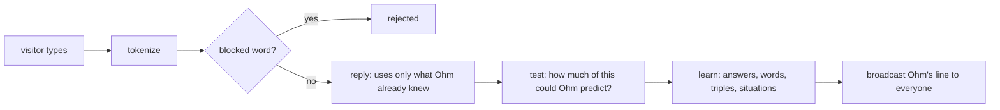

# ohm-api
The backend of **Ohm, the internet's robot pet**: one pixel robot shared by everyone online.
Visitors charge it, play with it, reboot it, and teach it to talk.

- Live API: `https://ohm-api.t4magoro.workers.dev` (`/state`, `/vitals`, `/ws`)
- Live site: `https://t4magoro.github.io/ohm/` (frontend repo: `t4magoro/ohm`)

## Stack

| Part | Tech |
|---|---|
| Server | TypeScript Cloudflare Worker + one Durable Object `Ohm` (SQLite, WebSocket hibernation, alarms) |
| Pet math | C++ compiled to WebAssembly (`cpp/pet.cpp`, no heap, fixed static buffer) |
| Word lists | `tools/build_wordlists.py` → `wordlists/` (FrequencyWords top 30k id + en, LDNOOBW blocklist + `block-id.txt`) |
| Tests | Vitest against real SQLite (`node:sqlite`) and the real `pet.wasm`; native C++ asserts with sanitizers |

## Running it

Everything runs in Docker. You don't need Node on the host.

| Task | Command |
|---|---|
| Start the API | `docker compose up -d`, then open http://localhost:8787/state |
| C++ test | `docker compose exec api npm run test:cpp` |
| Unit tests | `docker compose exec api npm test` |
| Typecheck | `docker compose exec api npm run typecheck` |
| Rebuild word lists | `docker run --rm -v "${PWD}:/app" -w /app python:3.13-alpine python tools/build_wordlists.py` |

For local secrets, copy them into `.dev.vars` (gitignored): `ADMIN_TOKEN`, `IP_SALT`, `FAKE_WEATHER`.

---

## How Ohm learns to talk

Ohm has no AI model. It **counts which word follows which** in what visitors type, and **which words people
use in which situation** (rain, night, charging…). To talk, it repeatedly picks a likely next word. It can only
say words it has learned. There are **no levels**: Ohm babbles where it has no evidence and speaks in sentences
where it has, from the very first message. Every rule below was tested before it was built, in a simulation with
real Bandung weather: `ohm-app/research/brain_sim.ipynb`.

The code: `src/brain.ts` (learning and talking), `src/grounding.ts` (word + situation links), `src/answers.ts`
(what people answer), `src/mind.ts` (skills and counters), `src/situation.ts` (what's happening now),
`cpp/pet.cpp` (the weighted random pick).

### 1. From message to words

`tokenize` (`src/words.ts`) lowercases the text and keeps only letters, plus `'` and `-` inside a word.
It reads at most 20 words:

```
"Aku  SUKA kopi!!"  →  ["aku", "suka", "kopi"]
```

Then `normalize` folds chat spellings into one, to store the word under. Stretched letters are squashed
(`bangettt` → `banget`), and common spellings of the same word are stored as the one that ranks highest in the
word list (`gak`, `ga`, `nggak` → `tidak`), so they pool their evidence instead of each needing two people of
its own: in the simulation (notebook section 18) Ohm knew 5% more of what people typed, and the approval queue
shrank by 60%. But Ohm *says* each word the way most people type it to him: `hear()` counts the spellings (once
per browser in a row, like sightings), and `inStyle()` picks the most used one. If most people write `ngga`, Ohm
says `ngga`. The groups are a hand-written list in `src/words.ts`.

If **any** word is on a blocklist (the built-in one or the admin's), the whole message is rejected.
Ohm doesn't reply, and it learns nothing.

### 2. Answer first, then test, then learn



Ohm replies **before** it learns from the message. Done the other way round, a sentence full of brand-new
words would be the only path the chain knows, and it would come straight back out to everyone online.
Visitors' messages are never shown to others: only Ohm's replies are broadcast. What's kept is single words and
counts, with one exception: a message you write right after Ohm talks to you is kept whole, as an answer he may
repeat (section 6). And his replies can repeat what one visitor typed, word for word (section 4).

### 3. Learning: words, triples and the visitor rule

`hear()` looks at each word:

| The word is… | What happens |
|---|---|
| already known | its `uses` counter goes up |
| in the Indonesian or English word list | Ohm learns it and remembers who taught it (for the feed and "while you were away") |
| unknown | it waits in the `pending` queue for the admin to approve or block |

Then Ohm counts **word triples**: "after these two words, this word came next". The message is padded with a
start marker `<s>` and an end marker `</s>`, and stored in `grams (p2, p1, next, count, last_by)`:

```
"aku suka kopi"  →  <s> <s> aku suka kopi </s>

(<s>, <s>)  → aku
(<s>, aku)  → suka
(aku, suka) → kopi
(suka, kopi)→ </s>
```

It also counts **word pairs** in `pairs (p1, next, count, last_by)`, for when two words aren't enough:
`aku → suka`, `suka → kopi`, `kopi → </s>`.

**The visitor rule:** a count only goes up when a **different visitor** (salted IP hash) than last time typed
it. `last_by` remembers who raised it last. So count 2 means "typed from at least two different internet
connections", and one person repeating a sentence 30 times still counts once.

**Unknown words cut the chain.** "aku suka xyzzy kopi" is learned as two pieces, `aku suka` and `kopi`, so
Ohm never learns that `kopi` follows `suka` from a sentence it didn't fully understand.

### 4. No levels: trust grows with evidence

To pick the next word, Ohm looks at the **last two words** (the triple), else the **last word** (the pair),
else it **babbles**. Each step uses *absolute discounting* with D = ¾: every count loses three quarters.

Example: Rina and Budi typed `aku suka kopi`, Citra typed `aku suka teh`. After `aku suka`:

| next | count | count − ¾ (weight) |
|---|---|---|
| kopi | 2 | 1¼ |
| teh | 1 | ¼ |

The total is 3 and there are 2 rows, so Ohm follows this context (3 − 1½) / 3 = **1 time in 2**, and then says
kopi 5 times in 6 and teh 1 time in 6. The other time he backs off to the last word only.

**Ohm learns like a toddler: from anyone.** A sentence one visitor typed has a quarter vote, so Ohm can say it,
but what two people said weighs five times as much, and repeating something never counts twice (the visitor
rule), so anything typed can come back to everyone. D = ¾ predicts people's next words best: −0.096 ± 0.012
bits/word against D = ½ on the 10 test worlds, chosen on the 3 tuning worlds and also the best on the test worlds
(notebook sections 19a, 24). Before brain v3 Ohm used D = ½ (section 10c), and before that D = 1, which never
followed one visitor's pattern (section 10).

**Why pairs have their own counts.** Adding up the triples that end in a word would count a pair one visitor
typed after two different words twice: Rina typing `aku kopi enak` and `kamu kopi enak` would add up to 2 for
`kopi enak`. Counting pairs with the visitor rule keeps it at one visitor (notebook section 10b), for about 3
more row writes per message.

**Talking from evidence.** The chance to back off is for *predicting* people: new words do come. When Ohm
*talks*, rolling it at the last word meant saying a random word. So he always follows a last word someone
continued (its chance shows as 1 in `why`) and only babbles after a word nobody continued. In the simulation
replies became fluent (every word pair typed by someone) 87% of the time instead of 70%, and pure babble fell from
4% to 0% (notebook section 19f). What he learns doesn't change.

**Babble** stops as often as real sentences end (`ends / (tokens + ends)`), otherwise it says any known word
(a random rowid: 1 row read). A reply made only of babble ends with `beep`.

### 5. Situations: which words belong where

`situation.ts` turns the moment into on/off facts: the part of the day in Bandung (`pagi`, `siang`, `sore`,
`malam`), `rain`, `hot` (above 30 °C), `battery_low` (below 50), `mood_low` (below 30), and `charge`/`play`/
`reboot` if *this* visitor did that in the last minute.

Each word sighting is counted per situation in `word_ctx (word, situation, n)`, with the totals in the mind.
Here the visitor rule counts **browsers** (the random visitor ID the site keeps), not IPs, so friends on one
Wi-Fi can each teach Ohm what a word goes with. A word gets a **link** (`links`) to the situation it's most
clearly tied to, if Dunning's **G²** says it's no coincidence (G² ≥ 10.83, p < 0.001), the situation is more
likely when the word is said, and at least two different browsers said it there. G² compares a 2×2 table: this word or not × situation on or off.

Example: ten visitors chat in the dry (30 sightings). One visitor says `hujan` in the rain: G² = 8.8, which
could be chance, so no link. A second visitor says it: G² = 15.0, so **hujan → rain**. The Wilson rule from the first
plan would have linked it after one sighting; in the simulation it got only 22% of links right, G² got 92%.

**One sighting per word per clock hour.** G² treats sightings as independent, but messages in one hour all share
one weather: one teaching drill on a hot afternoon linked `kabar` and `bagaimana` to hot days. So a word counts at
most once per clock hour (`words.last_hour`). In the simulation one drill left a wrong link on 270 of 300
world-days, and 5 with this rule, with no measurable loss of recall (notebook section 20). A drill at the *same*
hour every few days still links: that is a real pattern in what people typed, so teach at different times of day.
Schema step 11 took the sightings of the words the live drill had linked (`banget`, `kabar`, `bagaimana`, `dulu`,
`alhamdulillah`) out of every count, so they relearn under this rule.

### 6. Answers: what people reply to Ohm

Sections 3–5 learn what people *say*. To hold a conversation, Ohm also learns what they *answer*: that "apa
kabar" is answered with "baik". An **exchange** is Ohm's line to you, then your next message within 2 minutes.
His line waits on your connection (the WebSocket attachment), never in the database, and a new tab starts fresh.

- **Cues** are the 3 rarest words of his line and its 3 rarest word pairs (`kabar`, `lagi apa`).
- **Answer words** are the 3 rarest words of your message that weren't in his line.

Each exchange counts every cue (`cues.n`), every answer word (`answered`) and, with the visitor rule (browsers,
like situations), every cue + answer word (`cue_words`). A cue gets a **link** to its clearest answer word the
same way a word gets a situation (section 5): Dunning's G² ≥ 20, lift > 1, and two different browsers. 20 is
stricter than situations, chosen on the tuning worlds: fewer links, but more of them real answers.

Ohm also keeps your **whole answer** under each cue (`answers`, with the visitor rule), if he knows every word of
it: he only ever says words he knows, so an answer with a word still waiting for approval (often a name) is
never kept. Up to 20 per cue; a new one pushes out the least repeated.

Example: three visitors chat for a few minutes (32 exchanges). Ohm says `kabar` to them 9 times and they answer
`baik`, 8 times by the visitor rule: G² = 25.8, so **kabar → baik**. The next visitor who writes `apa kabar`
hears `baik`.

**Most specific wins.** If your message has a word pair Ohm has heard as a cue (`lagi apa`), only pair links
count, so a one-word link (`apa → baik`) can't answer a different question.

**Asking back.** When Ohm has no answer for you and you didn't ask him anything (no `apa`, `kenapa`, `mana`,
`siapa`, `bagaimana`, `kapan`, `berapa`), he asks you something 25% of the time, like a curious child: he starts
from a question word people use with him, so he hears more answers.

In the simulation (notebook section 18), Ohm went from answering 11% of common questions to 60% in a month (35%
when only 1 visitor in 5 writes back), and 88% of his links were real answers. Without the link filter, kept
answers turned him into a parrot: 96% of his replies were someone's message. The price: about 45% more row reads
and 6 more writes per message.

### 7. Talking: `reply()`

1. **Pick a start word (the seed).** If your message has a cue with a link, the **answer** (section 6). If not,
   and you didn't ask anything, 25% of the time a question word, to **ask back**. Otherwise usually the
   **topic**: the known word from your message with the lowest `uses` ("kopi", not "aku"). 30% of the time, or
   when none of your words is known, Ohm starts from **what's on his mind**: the word most clearly tied to his
   current situation (`hujan` when it rains). Otherwise a random known word.
2. **Say a whole answer**, if one he kept for that cue has the answer word: the one given most often.
3. Otherwise **walk the chain** (step 4) until `</s>` or 12 words.

Extras: at night Ohm talks in his sleep (`zzz… `). If mood is empty he sulks instead of answering. Every word
he says bumps a `said` counter, which feeds "Ohm used your words N times".

**Why Ohm said that.** `reply()` also returns how it built the answer (`Why` in `src/protocol.ts`), sent with the
live `line` message for the site's "think" button:

- `seed`: where Ohm started: your topic, the word tied to his situation (with that link's lift), a random word,
  the answer to a cue in your message (with the cue and that link's lift), or a question word when he asks back.
- `quote`: when he said a whole answer people gave, its words and how many times it was given.
- `steps`: for every word, the rungs he tried with their chance (1 at the last word when someone continued it),
  then the share of the word he picked, or, when he babbled, his chance to stop.

The numbers are exactly the ones Ohm used, from rows he had already read: no extra request, no extra row read.
`why` is never stored, so lines that come with the page have none. It only names words Ohm said. Two things it
does tell everyone: a chance shows how many *different* things people said after those words (never what), and a
topic seed was in your message.

### 8. Skills: the brain level, measured

Every message is scored **before** Ohm learns from it, so each one is a fair test. A skill is the average of
about the last 100 observations (`s ← s + (hit − s) / 100`), from 0 to 1:

| Skill | One observation | Hit when |
|---|---|---|
| words | each word in a message | Ohm already knew it |
| guessing | each known word in a message, and each sentence end | it was Ohm's most likely next word (section 4) |
| context | each word with a link | its situation is on right now |
| expression | a pat or frown on Ohm's reply (`rate`, only by the visitor he answered, once) | it's a pat |
| conversation | an exchange where Ohm had an answer ready for a cue of his own line (section 6) | your reply has that answer |

They're in `/state` as `brain.skills` and in the hourly snapshots. Guessing is top-1 next-word accuracy, the
usual test for a language model (notebook section 22): in the simulation, on messages from days the brain hadn't
seen, it reached about 35% by day 28, against 25% for always guessing the most common word. A word he doesn't know
breaks the sentence, as in learning. It replaced *sentences* (the share of his words that came from patterns) in
brain v3, because talking from evidence pins that at 100%: snapshots have sentences until then, guessing after.
Pats only move the meter: letting them change the counts either did nothing
measurable (+1) or made Ohm copy himself (+5).

### 9. The weighted pick, in C++

`pickWeighted` (TypeScript) writes the weights into a fixed buffer inside the WebAssembly memory (`weights_ptr`,
at most 4096 values, so there's no heap). They're counted in halves, 2 × count − 1, so they stay whole numbers.
Then it calls `pick_weighted(n, r)`, with `r` a random number in [0, 1):

```
weights = [3, 1]  (kopi: 2 visitors, teh: 1)    total = 4
r = 0.5 → x = 2.0 → 2.0 − 3 < 0  → index 0 → kopi
r = 0.9 → x = 3.6 → 3.6 − 3 = 0.6 → 0.6 − 1 < 0 → index 1 → teh
```

Think of it as a line of length `total`, cut into pieces as long as each weight. `r` points somewhere on the
line, and the piece it lands in wins.

### 10. Moderation hooks

- **Approve** (admin): a word from the queue joins the vocabulary. It gets no triples until someone uses it again.
- **Block** (admin): the word is removed from `words`, `pending`, every triple, its situation counts and link, its answer counts and links, and every kept answer that contains it, so Ohm can never say it again.
- **Report** (visitor): flags one of Ohm's lines for the admin page. The admin can remove it from everyone's screen (`unsay`).
- **Forget** (admin, `POST /admin/forget` with `{"text": …}`): Ohm forgets one kept answer under every cue. The admin page lists the newest 50. It can come back if people give it again.
- **Reset** (admin, `POST /admin/reset` with `{"confirm":"RESET"}`): Ohm forgets everything he learned. The blocklist, bans, reports, past lines, feed, Vitals history and milestones stay.

### Known limitations

- **Ohm can repeat what one person typed.** He learns like a toddler (section 4), so a sentence one visitor typed
  can come back, word for word, to everyone. The chat says so, and moderation (block, report, ban) is the safety
  net. Only words from the word lists or approved by the admin are ever learned, and never numbers.
- **One IP, one visitor for sentences.** People behind the same IP (one Wi-Fi, some mobile networks) count as one
  visitor for sentences: together they get a quarter vote, like one person. They can each teach situations (each
  browser counts).
- **Browsers are easy to fake.** One person with several browsers can fake or move situation links: the price of
  letting one Wi-Fi teach situations and answers. The 10 s chat cooldown is per IP.
- **Ohm keeps some messages whole.** What you write right after he talks to you can be kept and repeated to
  everyone, once two people taught him the same answer. Blocking a word removes every kept answer with it.
- **One link per word, and confounds.** In the simulation `panas` got linked to `siang`, because hot hours are
  midday hours.
- **Rare situations learn slowly.** `reboot` almost never happens, so its words may never get a link.