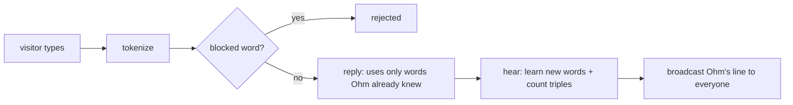

# ohm-api

The backend of **Ohm, the internet's robot pet**: one pixel robot shared by everyone online.
Visitors charge it, play with it, reboot it, and teach it to talk.

- Live API: `https://ohm-api.t4magoro.workers.dev` (`/state`, `/vitals`, `/ws`)
- Live site: `https://t4magoro.github.io/ohm/` (frontend repo: `t4magoro/ohm`)

## Stack

| Part | Tech |
|---|---|
| Server | TypeScript Cloudflare Worker + one Durable Object `Ohm` (SQLite, WebSocket hibernation, alarms) |
| Pet math | C++ compiled to WebAssembly (`cpp/pet.cpp`, no heap, fixed static buffer) |
| Word lists | `tools/build_wordlists.py` → `wordlists/` (FrequencyWords top 30k id + en, LDNOOBW blocklist + `block-id.txt`) |
| Tests | Vitest against real SQLite (`node:sqlite`) and the real `pet.wasm`; native C++ asserts with sanitizers |

## Running it

Everything runs in Docker. You don't need Node on the host.

| Task | Command |
|---|---|
| Start the API | `docker compose up -d`, then open http://localhost:8787/state |
| C++ test | `docker compose exec api npm run test:cpp` |
| Unit tests | `docker compose exec api npm test` |
| Typecheck | `docker compose exec api npm run typecheck` |
| Rebuild word lists | `docker run --rm -v "${PWD}:/app" -w /app python:3.13-alpine python tools/build_wordlists.py` |

For local secrets, copy them into `.dev.vars` (gitignored): `ADMIN_TOKEN`, `IP_SALT`, `FAKE_WEATHER`.

---

## How Ohm learns to talk: the Markov chain

Ohm has no AI model. It **counts which word follows which** in what visitors type. To talk,
it repeatedly picks a likely next word. It can only say words it has learned.
The code is in `src/brain.ts` (learning and talking) and `cpp/pet.cpp` (the weighted random pick).

### 1. From message to words

`tokenize` (`src/words.ts`) lowercases the text and keeps only letters, plus `'` and `-` inside a word.
It reads at most 20 words:

```
"Aku  SUKA kopi!!"  →  ["aku", "suka", "kopi"]
```

If **any** word is on a blocklist (the built-in one or the admin's), the whole message is rejected.
Ohm doesn't reply, and it learns nothing.

### 2. Answer first, then learn



Ohm replies **before** it learns from the message. Done the other way round, a sentence full of
brand-new words would be the only path the chain knows. It would come straight back out, word for
word, to everyone online. Visitors' messages are never stored as sentences or shown to others: only
single words and triple counts are kept, and only Ohm's replies are broadcast.

### 3. Learning: which words, and the triple counts

`hear()` looks at each word:

| The word is… | What happens |
|---|---|
| already known | its `uses` counter goes up |
| in the Indonesian or English word list | Ohm learns it and remembers who taught it (for the feed and "while you were away") |
| unknown | it waits in the `pending` queue for the admin to approve or block |

Then Ohm counts **word triples**: "after these two words, this word came next". The message is padded
with a start marker `<s>` and an end marker `</s>`:

```
"aku suka kopi"  →  <s> <s> aku suka kopi </s>

(<s>, <s>)  → aku
(<s>, aku)  → suka
(aku, suka) → kopi
(suka, kopi)→ </s>      each one: count + 1
```

They're stored in one table, `grams (p2, p1, next, count)`: p2 = two words back, p1 = the previous word.

**Unknown words cut the chain.** "aku suka xyzzy kopi" is learned as two separate pieces,
`aku suka` and `kopi`. That way Ohm never learns that `kopi` can follow `suka` from a sentence it
didn't fully understand.

#### Example

After three visitors type `aku suka kopi`, `aku suka teh` and `kamu suka kopi`, the table holds:

| p2 | p1 | next | count |
|---|---|---|---|
| `<s>` | `<s>` | aku | 2 |
| `<s>` | `<s>` | kamu | 1 |
| `<s>` | aku | suka | 2 |
| `<s>` | kamu | suka | 1 |
| aku | suka | kopi | 1 |
| aku | suka | teh | 1 |
| kamu | suka | kopi | 1 |
| suka | kopi | `</s>` | 2 |
| suka | teh | `</s>` | 1 |

### 4. Brain levels: how much context Ohm uses

The level comes from the vocabulary size (`brain_level` in `cpp/pet.cpp`):

| Level | Vocabulary | How Ohm picks the next word |
|---|---|---|
| 1 | under 50 words | no chain yet: 1–3 random known words + `beep` |
| 2 | 50–299 | looks at the **previous word** only |
| 3 | 300+ | looks at the **previous two words**. If that pair was never seen, it falls back to level 2 |

Level 2 uses the same table. It adds up the counts over every p2 (`SUM(count) … WHERE p1 = ? GROUP BY next`).
In the example, after `suka`: **kopi 2** (1 + 1) and **teh 1**, so kopi is picked 2 times out of 3.

Level 3 is pickier. After `kamu suka` it has only ever seen `kopi`, so it always says kopi.
After `aku suka` it's 50/50. More context means Ohm sounds more like real sentences,
but it needs far more data. That's why level 3 only starts at 300 words.

### 5. Talking: `reply()`

1. **Pick a start word (the seed).** Ohm picks the known word from your message with the **lowest `uses`**.
   The rarest word is usually the topic ("kopi", not "aku"). If none of your words is known, it picks a random known word.
2. **Walk the chain.** From the seed, it looks up the possible next words with their counts and picks one
   at random, weighted by count (step 6). Then it shifts: the last two words become the new context.
3. **Stop** at `</s>`, when no next word exists, or after 12 words.

Example at level 2: you type `kamu suka apa`. `apa` is unknown, `kamu` is rarer than `suka`, so the seed is `kamu`.

```
kamu → suka (only option) → kopi (2/3) or teh (1/3) → </s>
     = "kamu suka kopi"   or   "kamu suka teh"
```

Extras: at night Ohm talks in its sleep (`zzz… `). If mood is empty it sulks instead of answering.
Every word it says bumps a `said` counter, which feeds "Ohm used your words N times".

### 6. The weighted pick, in C++

`pickWeighted` (TypeScript) writes the counts into a fixed buffer inside the WebAssembly memory
(`weights_ptr`, at most 4096 values, so there's no heap). Then it calls `pick_weighted(n, r)`,
with `r` a random number in [0, 1):

```
weights = [2, 1]  (kopi, teh)    total = 3
r = 0.4 → x = 1.2 → 1.2 − 2 < 0  → index 0 → kopi
r = 0.8 → x = 2.4 → 2.4 − 2 = 0.4 → 0.4 − 1 < 0 → index 1 → teh
```

Think of it as a line of length `total`, cut into pieces as long as each count. `r` points somewhere on the
line, and the piece it lands in wins. When there are more than 4096 candidates, only the 4096 most common are kept.

### 7. Moderation hooks

- **Approve** (admin): a word from the queue joins the vocabulary. It gets no triples until someone uses it again.
- **Block** (admin): the word is removed from `words`, `pending` **and every triple that contains it**, so Ohm can never say it again.
- **Report** (visitor): flags one of Ohm's lines for the admin page. The admin can remove it from everyone's screen (`unsay`).

### Known limitation

A rare word has only a few triples, so a sentence can come back almost word for word when someone
uses one of its rare words later. The chat warns "don't type anything personal". A possible future fix is to
only follow triples that two or more different visitors typed.